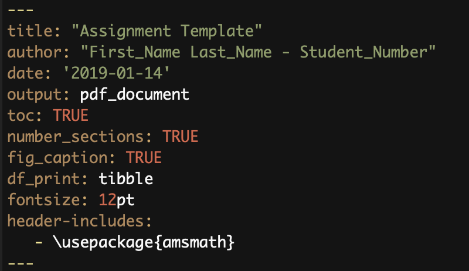

```{r Preamble, eval=TRUE, echo=FALSE, error=FALSE, message=FALSE}
library(gridExtra)
library(MASS)
library(ISLR)
library(car)
library(modelr)
library(gapminder)
library(broom)
library(e1071)
library(summarytools)
library(tidyverse)
library(knitr)
library(png)
library(jpeg)

set.seed(19971222)
```

# Week 1
Welcome to STA130 - An Introduction to Statistical Reasoning and Data Science! 

## Getting out of the Cloud
As I mentioned in tutorial, I highly recommend installing R locally and using that instead of the cloud based option. You will use R for the remainder of your undergraduate degree and this gives you more flexiblity in your work flow. I will provide information on install R and R Studio along with the necessary packages that will help you output beautiful PDF documents of our work. 

#### Installing R
As a Universiy of Toronto student you have special privelages when it comes to installing R. Visit the U of T specific [CRAN-R](http://cran.utstat.utoronto.ca/) and download the appropriate installation module for your operating system. Follow the instructions once you unzip the folder.

#### Install R Studio 
Head to the [R Studio](https://www.rstudio.com/products/rstudio/download/) and download the *free* version (first column of the table). Follow the instructions once you unzip the folder. 

#### .Rmd Files
.Rmd files will be our go to work environments for R. They allow us to maintain a very clean and organized work flow and support LaTeX input to help render equations, amongst other things which we will not need fow now. The [.Rmd code](Files/STA_Assignment_Template.Rmd) for my assignment/project ([click for preview](Files/STA_Assignment_Template.pdf))  template is a good starting point which can be used in anoy of your courses. The top of the document contains something called a YAML header:
```{r YAML Header, echo=FALSE, fig.cap="My YAML header. Modify as you see fit", out.width = '50%'}

```

This controls the style of the output. For all the options you have with respect to this section, check this [link](https://bookdown.org/yihui/rmarkdown/pdf-document.html). 

#### knitr and TeX 
The first package in R you must install/update is `r print("knitr")`. Copy the below code into you console.

```{r Install knitr, eval=FALSE, echo=TRUE}
install.packages("knitr")
library(knitr)
```

Next you need a TeX rendering software. I recommend [MiKTeX]{https://miktex.org/download}. This just needs to be downloaded, installed, and forgotten about. It will always be running in the background and will render any LaTeX equations in your .Rmd files. Here is an example of an equation in LaTeX: 

$$ \rho(x,y) = \frac{\sum_{i=1}^{n} (x_i-\bar{x}) (y_i-\bar{y}) }{\left ( \sum_{i=1}^{n} (x_i-\bar{x})\right)^\frac{1}{2} \sqrt{ \sum_{i=1}^{n} (y_i-\bar{y})}} $$

***

## Some material 
This week we focused on ways to represent our data, mainly through histograms, bar graphs, and scatter plots. I will be using the *Highway1* dataset for examples. Here is a preview: 

```{r Dataset, eval=TRUE, echo=TRUE, message=FALSE, error=FALSE}
df <- as.data.frame(Highway1)
head(df)

# I'm going to select a few columns so we don't carry the whole data frame around
df <- df %>% 
        select(rate, slim, lane)
head(df)
```

#### Histograms 
**What:** a graph used to display counts of continous variables. The X-axis splits the data into *bins* that provide a range your data could take while the Y-axis displays the frequencies of points in each of the respective bins. 

**Why:** examine the spread of your variable with respect to the values it could take

**Example:** 
```{r Histogram example, eval=TRUE, echo=TRUE, message=FALSE, error=FALSE}
hg <- df %>% 
  ggplot(aes(rate)) + 
  geom_histogram(binwidth = 1, fill = "steelblue", colour = "navy", alpha = 0.9) + 
  labs(title = "Histogram for Number of Lanes", 
       xlab = "Number of Lanes", 
       ylab = "Counts") + 
  scale_x_continuous(breaks = seq(0, max(df$rate), by = 1)) +  
  theme_minimal() 

hg
```

#### Bar Graphs

**What:** a graph used to display counts of categorical variables. The X-axis splits the data into different labels your data could take while the Y-axis displays the frequencies of the data for the respective labels 

**Why:** examine the spread of your variable with respect to the values it could take

**Example:** 
```{r Bar Graph example, eval=TRUE, echo=TRUE, message=FALSE, error=FALSE}
bg <- df %>% 
  ggplot(aes(factor(slim))) + 
  geom_bar(fill = "steelblue", colour = "navy", alpha = 0.9) + 
  labs(title = "Bar Graph for Speed Limits ", 
       x = "Speed Limit (mph)", 
       y = "Counts") +
  theme_minimal()
# note that I used the factor() function around the slim variable to ensure this is categorical 
bg
```

#### Scatterplots 

**What:** mapping pairwise data points on a Cartesian plane. This works best for continuous data but can be done with factors as well. However, factors are best shown through the aesthetic functionality of ggplot via colours or with facets. 

**Why:** examine the relationship between the variables

**Example:** 
```{r Scatterplot example, eval=TRUE, echo=TRUE, message=FALSE, error=FALSE}
sp <- df %>% 
  ggplot(aes(x = slim, y = rate)) +
  geom_point(aes(color = factor(lane)), alpha = 0.7) + 
  labs(title = "Accident rate vs. Speed Limit",
       x = "Speed Limit (mph)",
       y = "Rate (per Million Vehicle Miles)") +
  geom_smooth(method='lm')+
  theme_minimal()
# note how the factor(lane) is in the geom_point as to tell ggplot to consider the full dataset
# when constructing the line of best fit. Putting it as an argument to ggplot will result in lines
# of best fit for each factor level (try this on your own)
sp 
```

# Week 2
This week was dedicated to summary statistics, specifically *mean, median,* and *standard deviation*. For the purpose of this week we will work with the imaginary and arbitrary dataset known as
$$X = \{ x_1, x_2, \ldots, x_n \} $$

### Median
Our first measure of centrality is the *median*. Simply put, it is the middle most number of our data set. Defining what we mean by "middle" in a more mathematical framework, the median refers to the point at which 50\% of the data lie below it, and 50\% of the data lie above it. 
$$ \mathbb{P}(X \geq m) \geq 0.5 \text{ and } \mathbb {P}(X \leq m) \geq 0.5$$
The point $m$ where this occurs, is the *median*. 

#### Order Statistics 
I will introduce the concept of an ordered statistic as a way of showing some of the computational intuition that is behind the median. Order statistics are simply an ordered (smallest to largest) version of our original dataset. Define a subset of our data

$$ Y = \{ x_{(1)}, x_{(2)}, \ldots, x_{(n)}  \} \text{ s.t. } x_{(1)} \leq x_{(2)} \leq \ldots \leq x_{(n)}$$

Each of the $x_{(i)}$ come from $X$. By extension, the median can now be easily computed by "crossing out"" one number from each end of the ordered statistic set. Two cases will arise; one where $n$ is even, the other when $n$ is odd, with the respective medians being listed below

$$ x_m = \left\{ \begin{array}{rcl}
     x_{(\frac{n+1}{2})} & \text{ for } & n \text{ odd} \\
     \frac{x_{(\frac{n}{2})} + x_{(\frac{n}{2} + 1)} }{2} & \text{ for } & n \text{ even} 
\end{array} \right. $$

### Mean
Often referred to as the average, the mean refers to the arthemetic middle of a set of numbers. It is defined by 
$$ \mu = \frac{ \sum_{i=1}^N x_i}{N} $$
One thing I'd like to highlight regarding the mean is that we now take into account the magnitude of each measurement $x_i$. With the median, we look at the middle most number regardless of large they are but now we put value on the size of that measurement. 

### So why does it matter?
This becomes of vital importance when we look at skewed distributions.. The example below highlights the difference between the mean and median. 

```{r Mean and Median Difference Sym, eval=TRUE, error=FALSE, echo=TRUE}
set.seed(19971222)

sym <- as.data.frame(cbind(c(1:500), rnorm(500))) # generate 500 random numbers from a symetric distribution
colnames(sym) <- c("index", "rnum")

sym_mean <- mean(sym$rnum)
sym_med <- median(sym$rnum)
# get into a format that tidyverse likes


sym %>% ggplot(aes(sym$rnum)) + 
  geom_histogram(binwidth = 0.2, fill = "steelblue", colour = "navy", alpha = 0.9) + 
  geom_vline(xintercept = sym_mean, colour = "red") + 
  geom_vline(xintercept = sym_med, colour = "yellow") + 
  labs(title = "Histogram of 500 Randomly Generated Numbers from the Standard Normal", 
       x = "Value", 
       y = "Frequency") +
  theme_minimal()

```
From the graph, we can see that the mean and median are almost identical. More specifically, the mean has a value of `r round(sym_mean, 6)` and the median has a value of `r round(sym_med, 6)`. This will hold true for all symetric distributions. Furthermore, as we increase the amount of numbers generated the two will converge and be equal. This is a fun proof and you can do it as an exercise, otherwise, replicate the code above but use try generated 10,000 or 1,000,000 numbers and verify that difference. 

Now let's check the non-symetric/skewed case. 
```{r Mean and Median Difference Non-sym, eval=TRUE, error=FALSE, echo=TRUE}
set.seed(19971222)

sym <- as.data.frame(cbind(c(1:500), rchisq(500, df = 2))) # generate 500 random numbers from a symetric distribution
colnames(sym) <- c("index", "rnum")

sym_mean <- mean(sym$rnum)
sym_med <- median(sym$rnum)
# get into a format that tidyverse likes
central_measures <- as.data.frame(cbind(sym_mean, sym_med))
colnames(central_measures) <- c("mean", "median")

sym %>% ggplot(aes(sym$rnum)) + 
  geom_histogram(binwidth = 0.4, fill = "steelblue", colour = "navy", alpha = 0.9) + 
  geom_vline(aes(color = 'Mean'),xintercept = sym_mean, colour = "red", show.legend = TRUE) + 
  geom_vline(aes(color = 'Median'), xintercept = sym_med, colour = "yellow", show.legend = TRUE) + 
  scale_color_manual(values = c("red", "yellow")) +
  labs(title = "Histogram of 500 Randomly Generated Numbers from the Chi-Squared Distribution", 
       x = "Value", 
       y = "Frequency") +
  theme_minimal()
```

As you can see, the difference between the mean and the median is more apparent given this skewed distribtion. You should think about what happens if the distribution is left skewed and try to code an example of it to verify your conjecture.

### Measures of Spread - Variance/Standard Deviation
The last thing that we will examine this week is measuring dispersion in our data with the idea of standard deviation. This is quite literally how far your data strays from it's central point, the mean. Before diving into the specifics of this quantity, I'd like to go over the idea of distance from a mathematical perspective. 

In general, we use *norms* to quantify how far something is from a given point in space. A norm is any mapping $g:\mathbb{R}^n \rightarrow [0,+\infty)$ which obeys the triangle inequality, closed under scalar multiplication, and has the zero vector being mapped to 0. You can look this up in more detail on the [Wikipedia](https://en.wikipedia.org/wiki/Norm_(mathematics)) page but this is strictly outside of the scope of this course and not necessary (cool if you are curious about the mathematical intricacies of the concept). For our purposes, we will be working with the $L_2$ norm, which is more often known as the Euclidean distance. In the case where you are interested in the distance of a point from any other point that is not the origin, say $\mu_x$, it is define as
$$L_2 :\mathbb{R}^n \rightarrow [0,+\infty) \text{ s.t. } x \mapsto \sqrt{ (x_1 - \mu_x)^2 + \ldots + (x_n - \mu_x)^2}$$

We will use this as a way of quantifying how far each point is from the mean of the data set. As such, if we want to measure the total spread we should add up the distance from every point to the mean. The variance will then be defined as 

$$ Var(X) = \frac{\sum_{i=1}^N (x_i-\mu_x)^2}{N}$$
But note that the square root is missing and gives variance very little meaning from an intuitive perspective. It is not until we introduce that square root and use the previously mentioned $L_2$ norm that we bring this concept back to the idea of distances in space which gives rise to the more useful *standard deviation* which we will from now on label $\sigma_x$.

$$\sigma_x = \sqrt{Var(X)} = \sqrt{\frac{\sum_{i=1}^N (x_i-\mu_x)^2}{N}}$$

### Population Statistics vs. Sample Statistics 

You may have noticed my deliberate use of $N$ in the denominators of the mean and standard variation which represents the size of the whole population (if we are measuring the height of humans, we would need to measure [every](http://www.worldometers.info/world-population/) person in the world). However, measuring a full population is not always feasible and as such we must settle for a subset of the population which will we will refer to as a *sample* from this point on. In a sample, you will always be taking $n < N$ (and often times $n << N$) members of the population. As such our formulas will be modified in the following way.

$$ \hat{\mu}_x = \bar{x} = \frac{\sum_{i=1}^n x_i}{n} $$
A subtle distinction arises when computing the variance. Since the variance is a function of both the data and the mean we must differentiate between the estimated population standard deviation ($\hat{\sigma}_x$) and the sample standard deviation $s_x$. When estimating the population standard deviation using a sample you will notice that we use the population mean above. This would only be doable if the mean is known ahead of time and given to you. 
$$\hat{\sigma}_x = \sqrt{\frac{\sum_{i=1}^n (x_i-\mu_x)^2}{n}}  $$
However, there are many instances where the population mean will not be available. In this case we will be forced to use an estimate of the population mean, the sample mean. This gives rise to the sample standard variation which we define in a similar way.
$$ s_x = \sqrt{\frac{\sum_{i=1}^n (x_i-\bar{x})^2}{n-1}} \text{ with } \lim_{n \rightarrow \infty} s_x = \sigma_x$$
You will notice that the denominator has slightly different since we are now dividing by $n-1$ instead of the $n$ we've used previously. The reason for this is because we are loosing a [degree of freedom](https://en.wikipedia.org/wiki/Degrees_of_freedom_(statistics)) when using that estimated mean. The simplest explanation (leaving out many important and interesting details which you will see in later statistics courses) is when given the sample mean I could take away 1 data point from your sample and you would still be able to figure out what your sample was based on the $n-1$ numbers and that mean (you can algebraically back out the n-th point). 

# Week 3

This week was centered around *data wrangling*. As a general definition, data wrangling or data cleaning refers to any and all manipulations or changes you make to your data in order to get it ready to be analyzed. Within the **tidyverse** package there are several tools, specifically the [dplyr](https://www.rstudio.com/wp-content/uploads/2015/02/data-wrangling-cheatsheet.pdf) package, which are useful in organizing your data. Each data set is unique and will require some cleaning before it is ready for being analyzed. As such I will not go into any details regarding methodologies or give examples, there are just too many possibilities.

# Week 4
P values 

QUESTIONS 

(a) A health survey asked 200 individuals aged 20-45 living in Toronto to report the number
minutes they exercised last week. Researchers were interested in determining whether the 
Version Feb 4, 2019.
average duration of exercise differed between people who consume alcohol and those who
do not consume alcohol. Assume the researchers who conducted this study found that
people who drank alcohol exercised, on average, 20 minutes per week. In contrast, people
who did not drink alcohol exercised 40 minutes per week, on average. The researchers
reported a p-value of 0.249.
(b) A study was conducted to examine whether the sex of a baby is related to whether or
not the baby’s mother smoked while she was pregnant. The researchers used a birth
registry of all children born in Ontario in 2018, which included approximately 130,000
births. The researchers found that 4% of mothers reported smoking during pregnancy and
52% of babies born to mothers who smoked were male. In contrast, 51% of babies born to
mothers who did not smoke were male. The researchers reported a p-value of 0.50.
(c) Based on results from a survey of graduates from the University of Toronto, we would
like to compare the median salaries of graduates of statistics programs and graduates of
computer science programs. 1,000 recent graduates who completed their Bachelor’s
degree in the last five years were included in the study; 80% of the respondents were
female and 20% were male. Among statistics graduates, the median reported income was
76,000. Among computer science graduates, the median reported income was 84,000.
The researchers reported a p-value of 0.014.
(d) A team of researchers were interested in understanding millennial’s views regarding
housing affordability in Toronto. The team interviewed 850 millennials currently living in
Toronto. 84% reported that they felt housing prices were unaffordable in the city. Suppose
the researchers were interested in testing whether this proportion was different from a
study published last year, which found that 92% of millennials reported that housing costs
were unaffordable. The researchers reported a p-value of 0.023.

# Week 6 
[The questions](Files/Week6.docx)


# Week 8 
Here are the questions.

### Topic 1
* Refer to Question 4 from the homework.
* Explain how to make a ROC curve and the type of information it provides.
* Based on the ROC curves provided, describe the accuracy of each of the 3 trees.
* Does this fit your expectations based on the description of how each classifier identified
spam emails?

### Topic 2
* Refer to Question 2 from the homework.
* Explain what a confusion matrix is and how each cell is calculated.
* Using the calculated confusion matrix answer the following questions: What percentage of
disease positive people who were classified as disease positive were actually disease
positive according to cutpoint A? According to cutpoint B?
* What is another term used to describe the percentage you calculated above?

### Topic 3
* Refer to Question 1b.
* Summarize the classification tree from part (b); make sure to include at least the following
points: how the splits on each variable were selected, how a new observation would be
predicted by this classification tree.
* Do you think there may be other important factors to consider? Explain.

# Week 9

### Topic 1
* Questions 1a and 1c
* Describe your plot produced in question 1a. Make sure to note the x- and y-axis and to describe the association you observe, if any. E.g. the association linear, positive, negative, strong, weak, etc.?
* What is the correlation between head size and brain weight? Make sure to explain how you calculated this value and what it means; i.e., provide an interpretation of the value.
* Does this make sense based on your prior expectations? Are there any other variables you think may be important factors influencing brain weight?
* Do there appear to be many outliers? Why might this matter?

### Topic 2
* Questions 1d-f
* Provide a simple linear regression equation for the association between head size and brain weight. Explain what each part of the model means in lay terms.
* Based on your answer to part e, report the estimated values of your model and provide an interpretation of these values.
* How well does your model fit the data? Explain what the coefficient of determination means and provide an interpretation.

### Topic 3
* Question 2c
* Present your regression model of msrp on year based on the training set.
* What is the model equation and estimated values? What is the coefficient of determination? Explain what these values mean and an interpretation in lay terms.
* How well does your model perform?

### Topic 4
* Question 2d
* What is your predicted 2013 msrp for a 2010 model hybrid vehicle? Make sure to present your regression equation, including all coefficients.
* Suppose the actual 2013 msrp for this 2010 model hybrid vehicle was $27,000. What is the residual? Provide an interpretation in lay terms. Is this a large difference? Based on previous work done in this question, why do you think this may be the case? Hint: Think about how well the model fits the data, if there may be other important factors, etc.


```{r Linear Regression}
# begin by generating data
x <- runif(1000, min = 0, max = 10)
y <- rnorm(1000, mean = 7, sd = 1)
df1 <- as.data.frame(cbind(x, y))
colnames(df1) <- c("x", "y")

# the boring case
model1 <- lm(y ~ x, data = df1)
summary(model1)

LR1 <- df1 %>% ggplot(aes(x, y)) + 
  geom_point(fill = "steelblue") + 
  geom_smooth( color = "navy") +
  labs(title = "Linear Regression Sample Graph", 
       x = "x", 
       y = "y") +
  theme_minimal()
LR1
```
```{r Linear Regression 2}
# what if there is some underlying structure? 
y2 <- 0.527*x + rnorm(1000, mean = 0, sd = 1)
df2 <- as.data.frame(cbind(x, y2))
colnames(df2) <- c("x", "y")

model2 <- lm(y ~ x, data = df2)
summary(model2)

LR2 <- df2 %>% ggplot(aes(x, y)) + 
  geom_point(fill = "steelblue") + 
  geom_smooth(color = "navy") +
  labs(title = "Linear Regression Sample Graph with underlying structure", 
       x = "x", 
       y = "y") +
  theme_minimal()
LR2
```

Because regression is a bit boring lets try to look at when it fails and how to fix that (note this is outside the scope of the course).

```{r Non-linear regression}
# what if there is some underlying NON LINEAR structure? 
y3 <- 7 + log(x) + rnorm(1000, mean = 0, sd = 1)
df3 <- as.data.frame(cbind(x, y3))
colnames(df3) <- c("x", "y")

model3 <- lm(y ~ x, data = df3)
summary(model2)

LR3 <- df3 %>% ggplot(aes(x, y)) + 
  geom_point(fill = "steelblue") + 
  geom_smooth(method = lm,  color = "navy") +
  labs(title = "Linear Regression Sample Graph with underlying structure", 
       x = "x", 
       y = "y") +
  theme_minimal()
LR3
```

Not bad, but there's clearly something wrong since the shape of the data looks non-linear. We can fix this with a transformation. 

```{r}
# what if there is some underlying NON LINEAR structure? 
y4 <- log(7 + x + rnorm(1000, mean = 0, sd = 1))
df4 <- as.data.frame(cbind(x, y4))
colnames(df4) <- c("x", "y")

model3 <- lm(exp(y) ~ x, data = df3)
summary(model2)

LR4 <- df4 %>% ggplot(aes(x, exp(y))) + 
  geom_point(fill = "steelblue") + 
  geom_smooth(method = lm,  color = "navy") +
  labs(title = "Linear Regression Sample Graph with underlying structure", 
       x = "exp(x)", 
       y = "y") +
  theme_minimal()
LR4
```

We did it! It's now linear again! 

# Week 10

We discuss questions in your presentation groups and debrief as a class.

### Question 1
As pertaining to Q1a ii.
Carry out an hypothesis test to investigate whether the mean selling price is the same
for sellers who do and do not use stock photos. Assuming the conditions necessary for the inference
procedure to be valid are reasonable in this situation, what do you conclude? How could you apply a
method from earlier in the term to carry out this hypothesis test?

### Question 2
As pertaining to Q1c.
* Is there evidence of a difference between sellers with low and high ratings in the
relationship between ‘totalPr‘ and ‘duration‘?
* Is there evidence of a difference between sellers with medium and high ratings in the
relationship between ‘totalPr‘ and ‘duration‘?
* Is there evidence of a difference between sellers with low and medium ratings in the
relationship between ‘totalPr‘ and ‘duration‘? iv. Briefly explain a way to obtain p-values for the
tests needed to address iii?

### Evaluation 
*Please write a paragraph answering the following question.*
Using R, you fit two regression models that you defined in (2c). Which model do you think
would best explain the association between temperature and yield? Think about the shape of the
association and any model statistics that may be relevant. Are there any limitations to these
models? Remember to mention: your research question and the methods you applied.

# Week 11 
Not the last week yet! 

### Question 1

Interpret the p-value of this test to compare the mean improvement for Lumosity versus crossword
puzzles. How does it compare to the p-value estimated using the randomization test earlier in this
question? Is this surprising? Why or why not? Make sure to explain the methods you used.

### Question 2
What type of study did Hardy et al. conduct? What were the conclusions? Are there any limitations?

### Question 3
Is age a confounder of this association? Why or why not? 

### Question 4
What ethical considerations did Hardy et al. make in their study? Why were these steps necessary?
Consider the Statistical Society of Canada (SSC) Code of Ethical Statistical Practice, what practices
should you consider while completing your poster project?
